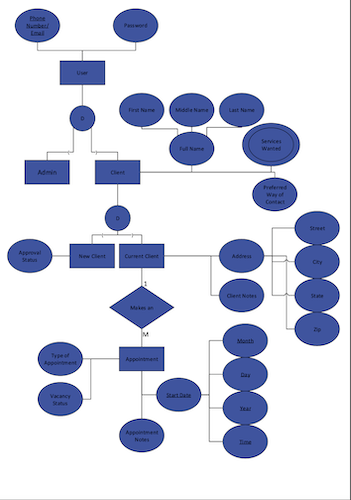
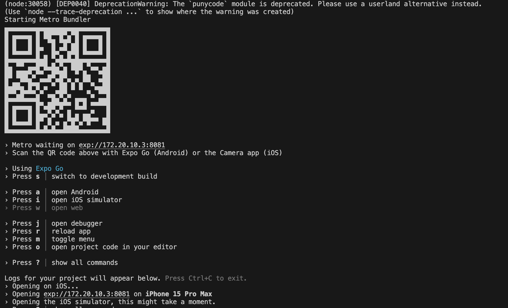
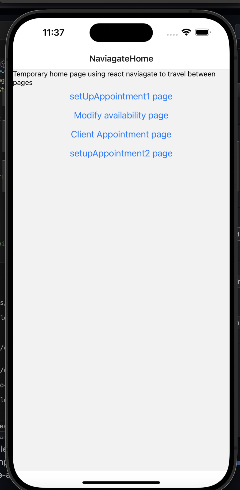
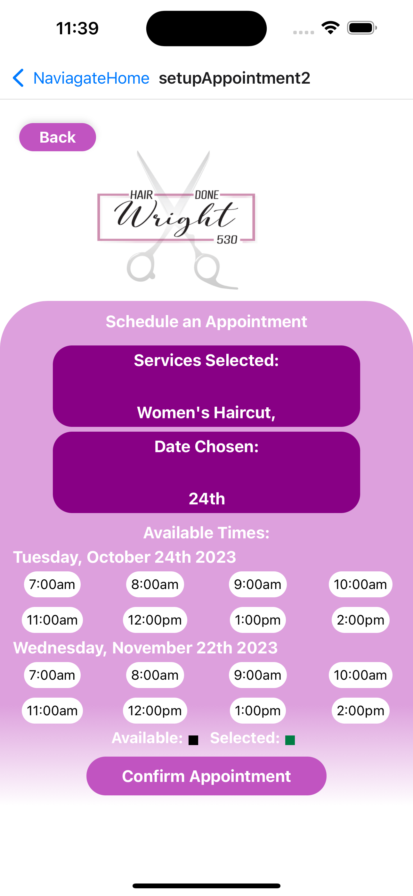
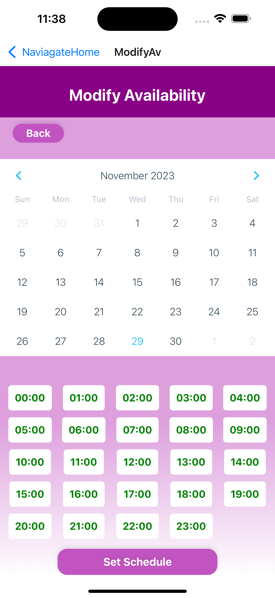
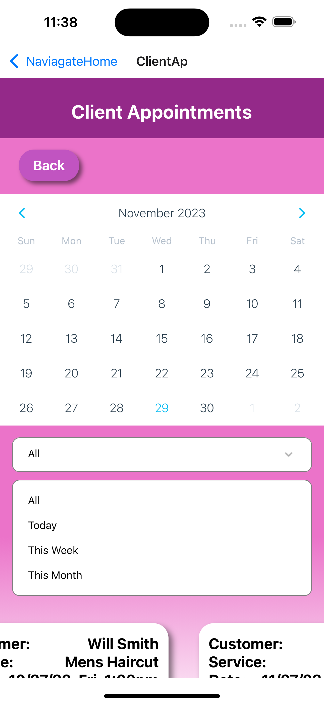
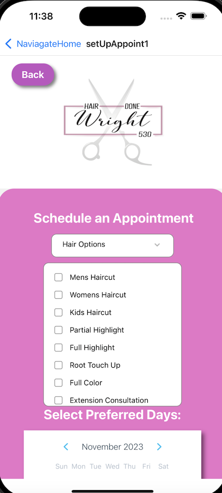

# Project Mullet 

This project is a beauty app being developed for HairDoneWright530. HairDoneWright530 is located in Olivehurst, California and is privately owned by 
Melissa Wright. 

This project is being completed by a team from Sacramento State University as part of a Senior Project over the time span of 2 semesters. 


## Authors

- [@Andrew Canada](https://github.com/CanadaAndrew)
- [@Chris Wright](https://github.com/cdub-616)
- [@Adrian Gonzalez](https://github.com/VoicelessBark44)
- [@Andrew Covert](https://github.com/acovert2)
- [@Leaith Rawashdeh](https://github.com/LeaithR)
- [@Tai Tang](https://github.com/ttang0)
- [@Cameron Ingersoll](https://github.com/CamIngersoll)
- [@Wilson Toy](https://github.com/Wilson-Toy)


## Project Flow (EERD)



## Project Completion Timeline in Jira


## Installation

You can install the project to run locally by installing a few different dependencies. 
In addition to the listed dependies below you will need npm and to create a expo app to run the app in.

```bash
  npx expo install expo-linear-gradient
  npm install --save react-native-calendars
  npx expo install expo-router react-native-safe-area-context react-native-screens expo-linking expo-constants expo-status-bar react-native-gesture-handler
  npm install react-native-dropdown-select-list
  npm install axios
  npm install mssql
  npm install express
  npm install cors
```
    
## Deployment

To deploy this project type in the terminal:

```bash
npm run
```
Or you can type:

```bash
npx expo start
```
Both of these commands should start the prject and bring you to wall of text with a
QR code that you can scan to run the app on your phone. We recommend you use 'npx expo start'. If you don't want to run this project on your phone using the QR code you can download a simulator and run it locally.

## Screenshots

### Terminal After Successfull Run


### Temporary Home Screen of App


### SetUp Appointment, Modify Availability, Client Appointment Screen
  

### SetUp Appointment Screen 2
 